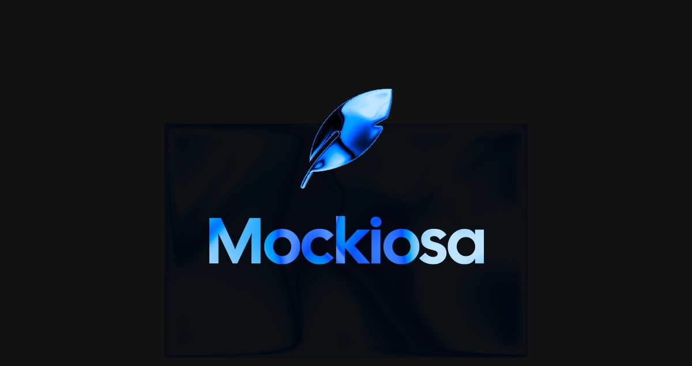
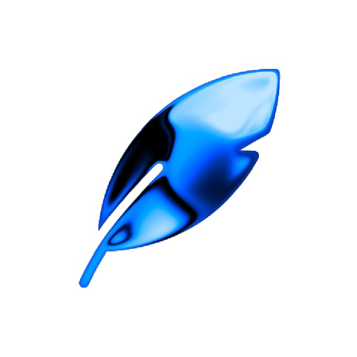

<p align="center">
  
</p>

<p align="center">
  
</p>

<h1 align="center">Mockiosa — Landing</h1>

<p align="center">
  Public marketing site for <strong>Mockiosa</strong>, the real-time 3D mockup studio for Framer.
  <br>
  Live at <a href="https://mockiosa.memselon.com">mockiosa.memselon.com</a>.
</p>

<p align="center">
  <a href="https://mockiosa.memselon.com">Website</a> ·
  <a href="https://www.framer.com/marketplace/plugins/mockiosa">Framer Marketplace</a> ·
  <a href="https://x.com/memselon">@memselon</a> ·
  <a href="https://x.com/meiiyve">@meiiyve</a>
</p>

---

## Stack

- **Next.js 16** (App Router, RSC, Turbopack)
- **React Three Fiber** for the hero + `/#live` playground
- **Tailwind + custom CSS tokens** for the design system
- **Vercel** for hosting (auto-deploy on push to `main`)
- **Cloudflare R2** for GLBs, HDRIs, marketing videos (via `memselon-media` Worker)

## Dev

```bash
npm install
npm run dev
```

Open [http://localhost:3000](http://localhost:3000).

## Structure

```
app/
  page.tsx            — Home hero + landing sections (locked behind /waitlist until launch)
  waitlist/           — Pre-launch waitlist page
  mockups/[slug]/     — Per-device SEO pages (iphone-air, macbook-pro, …)
  compare/[slug]/     — vs. Rotato / Smartmockups / Previewed / …
  guides/[slug]/      — Deep-dive articles
  changelog/          — Release timeline
  opengraph-image.tsx — Auto-generated OG card (iPhone Cosmic Orange + wordmark)
components/
  HeroPlayground.tsx  — Interactive 3D playground (client-only R3F)
  MerveTutorial.tsx   — Video tutorial section (VLC-lite custom controls)
```

## Deployment

Pushed automatically to Vercel `mockup-landing` on push to `main`. Preview deploys generated for every branch.

---

<p align="center">
  Built with 🫰 by <a href="https://x.com/memselon">Memselon</a> & <a href="https://x.com/meiiyve">May</a>
</p>
